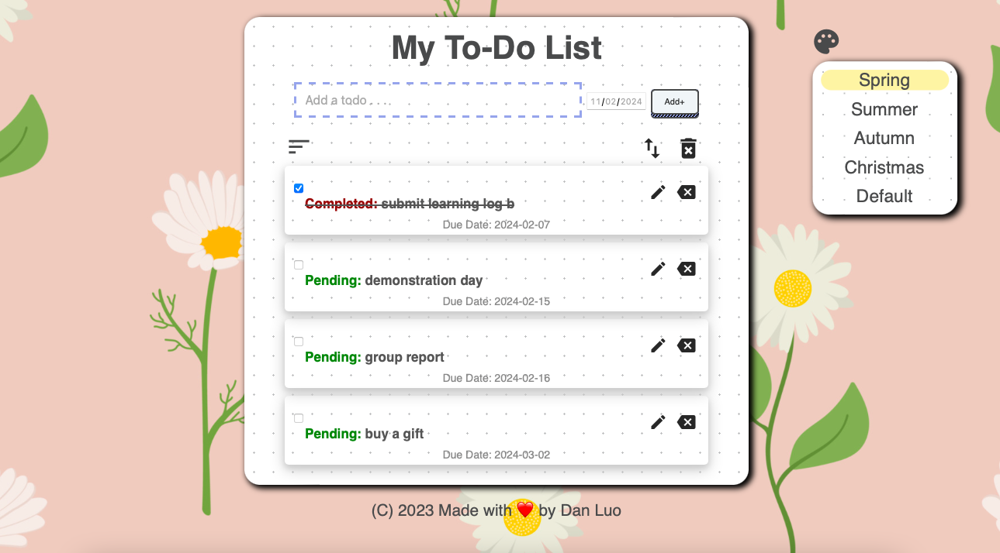

# my-todo
HTML, CSS, PHP, JavaScript, MySQL

This Todo List web app is a simple tool designed to help users organize their tasks effectively. Built using HTML, CSS, PHP, JavaScript, and MySQL, it provides a good user experience with the ability to add, edit, and delete todos, mark them as completed, and sort them based on completion status. Additionally, users can personalize their experience by changing the app's theme.

Add Todo: Easily add new todos to your list to keep track of tasks.
Edit Todo: Modify existing todos whenever you need to update task details.
Delete Todo: Remove todos from your list that are no longer relevant.
Mark as Completed: Mark todos as completed to track your progress.
Sort Todos: Sort todos based on their completion status for better organization.
Change Themes: Personalize your Todo List with different themes to suit your preference.

